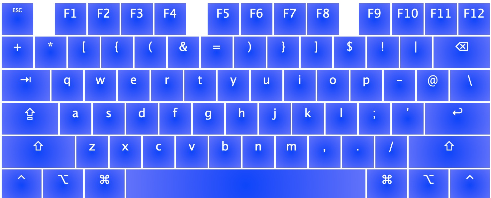
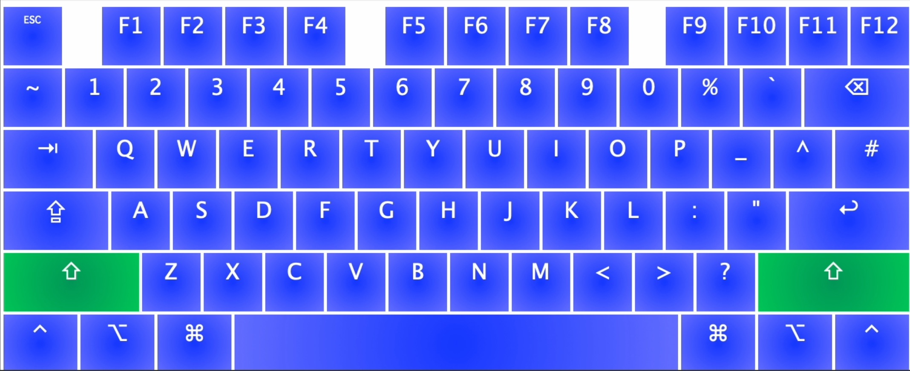

## Dotfiles

These are the config files that I have to setup a system the way I want it.

### Mac install

```
git clone git://github.com/arvinmi/dotfiles.git
sh mac/install/mac0.sh
sh mac/install/mac1.sh
```

### Devserver & server install

1. Follow installation instructions in 'install'

## Configuration

### Mac display resolution settings

```
2385 x 1541
```

### Mouse DPI

```
1500
```

### Mouse tracking speed (linearmouse)

```
1
```

### Mouse vertical scrolling speed (linearmouse)

```
35
```

### Mouse tracking speed (macOS)

```
6/10
```

## Keyboard layout

I am using a modified QWERTY layout (inspired by ThePrimeagen).

### Preview

Base layer:


Shift layer:

